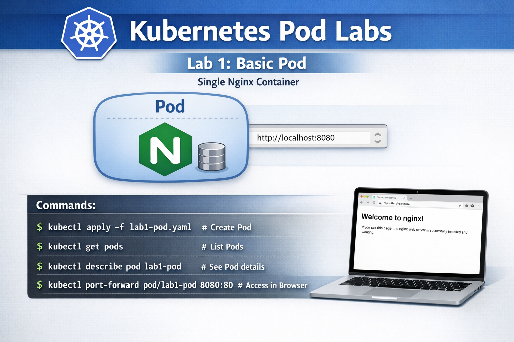
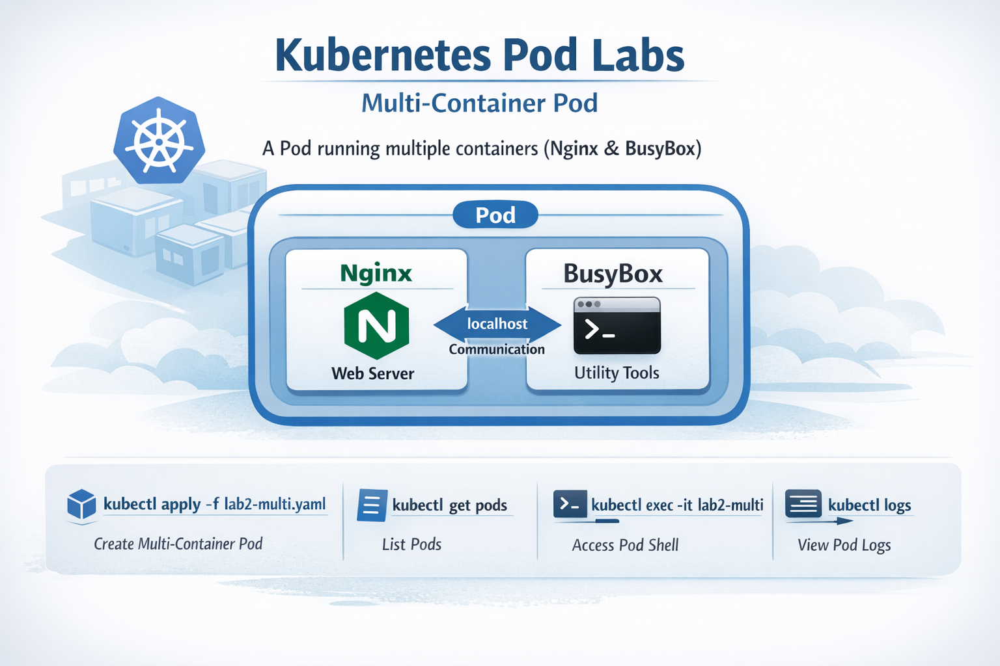

# Kubernetes Pod Labs


This directory contains practical **Kubernetes Pod labs** for learning and experimentation.  
These labs cover **basic Pods, multi-container Pods, environment variables, resource limits, volumes, and init containers**.

You can use these files to practice creating Pods in your cluster and understanding their behavior.

---

## **What is a Pod?**

A **Pod** is the smallest deployable unit in Kubernetes.  
It represents **one or more containers running together** on a node, sharing the same **network namespace and storage volumes**.

Key points:  
- Pods can contain **one or multiple containers**.  
- Containers in a Pod **share the same IP address** and **can communicate via localhost**.  
- Pods are **ephemeral**; they can die and be recreated by Kubernetes.  
- Common usage: encapsulate containers that need to run together.

---

## **Files in this directory and Commands**


### 1️

**Commands:**
```bash
kubectl apply -f lab1-pod.yaml            # Create Pod
kubectl get pods                          # List Pods
kubectl describe pod lab1-pod             # See Pod details
kubectl exec -it lab1-pod -- /bin/bash   # Enter Pod shell
kubectl port-forward pod/lab1-pod 8080:80 # Access Pod in browser (http://localhost:8080)
