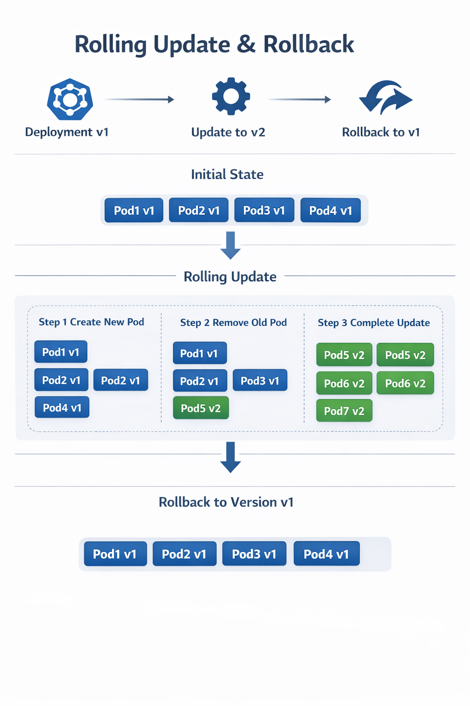
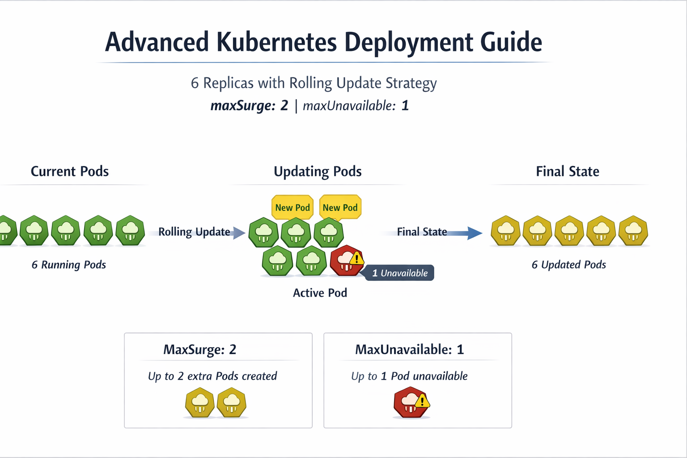

Kubernetes Deployments

This directory teaches everything about Kubernetes Deployments and how to manage Pods effectively.
It covers deployment creation, rolling updates, update strategies, maxSurge/maxUnavailable, and rollback (undo).

What is a Deployment?

A Deployment in Kubernetes is a higher-level abstraction over Pods that allows you to:

Automatically manage replicas: Ensures the desired number of Pods are always running.

Perform rolling updates: Update your application gradually with zero downtime.
Self-heal: Automatically replaces failed Pods.
Keep version history: Allows rollback to previous versions if updates fail.
Use declarative management: Define desired state in YAML and let Kubernetes handle the details.

Think of a Deployment as the controller that manages Pods for you, instead of creating Pods manually.

Key Concepts in Deployment
Replicas – The number of Pods you want running.
This ensures your application always has the desired number of instances available.
Strategy – Defines how updates are applied:
RollingUpdate: Updates Pods gradually to avoid downtime. You can control the pace using parameters like maxSurge (extra Pods allowed during update) and maxUnavailable (Pods that can be unavailable during update).
Recreate: Stops all old Pods before creating new ones, which may cause temporary downtime.
Rollback / Undo – Revert to a previous version if an update causes issues. Deployments keep a history of changes so you can go back safely.
Status & History – You can monitor rollout progress and see the revision history of your Deployment. This helps to troubleshoot and ensure updates are applied correctly.
Learning Tips
RollingUpdate is one by one by default, but you can adjust it with maxSurge and maxUnavailable to control update speed and availability.
Self-healing is automatic: if a Pod crashes or fails, the Deployment creates a replacement.
Declarative YAML is preferred over manually creating Pods because it ensures your desired state is maintained automatically.
Always monitor updates to avoid downtime and ensure stability.
#########################
# Kubernetes Deployment Lab – RollingUpdate Strategy

This lab teaches how to create and manage a **Kubernetes Deployment** with multiple replicas using the **RollingUpdate** strategy.
You will learn about **replica management, rolling updates, maxSurge, maxUnavailable, scaling, and rollback**.

---


## Lab Overview

In this lab, we will:

1. Create a Deployment with **6 Nginx Pods**.
2. Apply the **RollingUpdate strategy** with:
   - `maxSurge: 1` → Up to 1 extra Pod created during updates.
   - `maxUnavailable: 1` → Maximum 1 Pod can be unavailable during updates.
3. Observe how Kubernetes updates Pods gradually.
4. Practice scaling the Deployment up and down.
5. Simulate a failed update and perform a rollback.
6. Monitor Deployment status and history.

---

## Deployment Diagram

**Explanation:**

- **Current Pods:** 6 Pods running before update.
- **Updating Pods:** New Pods are added gradually (`maxSurge=1`) while some Pods may be unavailable (`maxUnavailable=1`).
- **Final State:** All Pods updated to the new version.

```text
[Pod1] [Pod2] [Pod3] [Pod4] [Pod5] [Pod6]   <- Old version
[Pod1] [Pod2] [Pod3] [Pod4] [Pod5] [Pod7]   <- During update (maxSurge=1, maxUnavailable=1)
[Pod7] [Pod2] [Pod3] [Pod4] [Pod5] [Pod6]   <- Final updated version


---

## Lab Steps and Commands

### 1. Create the Deployment
Apply the Deployment YAML file:
kubectl apply -f nginx-deployment.yaml

Verify the Deployment and Pods:
kubectl get deployments
kubectl get pods -l app=nginx
kubectl describe deployment nginx-deploy

---

### 2. Perform a Rolling Update
Update the Nginx image to a new version:
kubectl set image deployment/nginx-deploy nginx=nginx:1.25

Check rollout status:
kubectl rollout status deployment/nginx-deploy

---

### 3. Observe maxSurge and maxUnavailable
Watch Pods being replaced gradually:
kubectl get pods -w

You will notice:
- Extra Pod created up to maxSurge=1
- Some Pod temporarily unavailable up to maxUnavailable=1

---

### 4. Scale the Deployment
Scale up the Deployment:
kubectl scale deployment/nginx-deploy --replicas=8
kubectl get pods

Scale down the Deployment:
kubectl scale deployment/nginx-deploy --replicas=4
kubectl get pods

---

### 5. Simulate a Failed Update and Rollback
Apply a wrong image to simulate failure:
kubectl set image deployment/nginx-deploy nginx=nginx:nonexistent
kubectl rollout status deployment/nginx-deploy

Rollback to the previous working version:
kubectl rollout undo deployment/nginx-deploy
kubectl rollout status deployment/nginx-deploy

---

### 6. Monitor Deployment Status and History
Check rollout history:
kubectl rollout history deployment/nginx-deploy
kubectl rollout history deployment/nginx-deploy --revision=1

---

## Notes:
- The Deployment uses 6 replicas.
- RollingUpdate strategy:
  - maxSurge: 1
  - maxUnavailable: 1
- All commands above are used to create, update, scale, simulate failure, rollback, and monitor the Deployment.