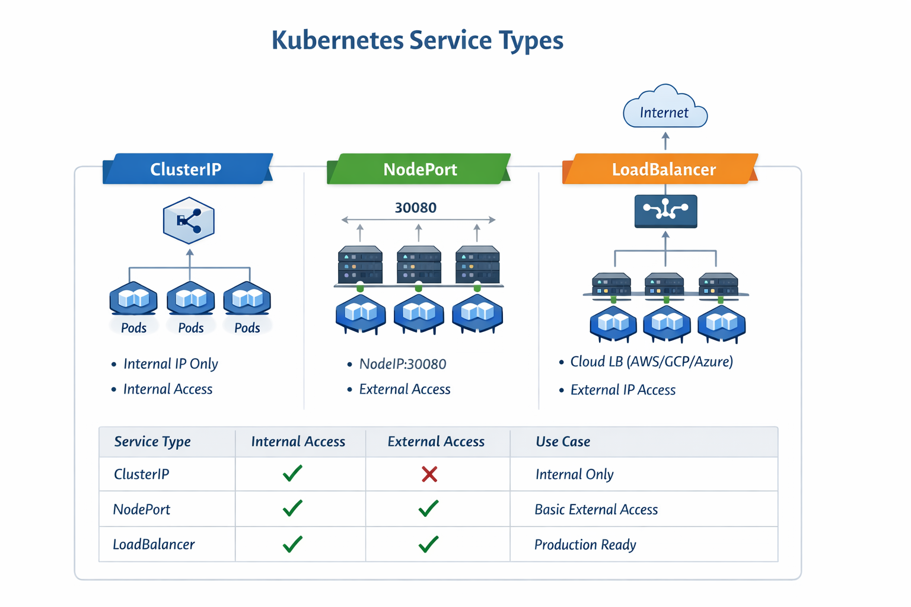

# Kubernetes Services Lab

Kubernetes **Services** provide a stable way to access **Pods** in a cluster. Since Pods are ephemeral and their IPs can change, Services give a **permanent endpoint** and handle networking between clients and Pods.

---

## Benefits of Services

- **Stable Networking:** Pods can be restarted or rescheduled, but Services provide a consistent IP or DNS name.  
- **Load Balancing:** Traffic is automatically distributed between the Pods in the Service.  
- **Internal Communication:** Services allow Pods to communicate inside the cluster without knowing each other's IPs.  
- **External Access:** Some Service types can expose applications to the outside world safely.

---

## Types of Services

### 1. ClusterIP
- **Default Service type**.  
- Exposes the Service on an **internal cluster IP**.  
- Accessible **only inside the cluster**.  
- Ideal for **internal communication** between Pods.  

---

### 2. NodePort
- Exposes the Service on a **port on each Node**.  
- **Accessible from outside** the cluster using `NodeIP:NodePort`.  
- Always has a **ClusterIP behind it** for internal access.  
- Suitable for **basic external access or testing**.  

---

### 3. LoadBalancer
- Exposes the Service externally using a **cloud load balancer** (AWS, GCP, Azure).  
- Combines **ClusterIP + NodePort + external IP**.  
- Production-ready **external access** for clients from the Internet.  
- Best choice for **public-facing applications** in the cloud.

---

## Summary Table

| Service Type   | Internal Access | External Access | Use Case                        |
|----------------|----------------|----------------|---------------------------------|
| ClusterIP      | ✅             | ❌             | Internal-only service           |
| NodePort       | ✅             | ✅             | Testing or basic external access|
| LoadBalancer   | ✅             | ✅             | Production cloud services       |

---

Lab 1: ClusterIP Service

In this lab we deploy an NGINX application and expose it internally using a ClusterIP Service.

This allows Pods inside the cluster to communicate with the application using a stable DNS name.

Step 1: Create the Deployment

Apply the deployment file:

kubectl apply -f clusterip-lab.yaml

Verify the pods are running:

kubectl get pods

Expected result:
You should see multiple nginx pods running.

Step 2: Verify the Service

Check the created service:

kubectl get svc

Example output:

NAME                TYPE        CLUSTER-IP      PORT(S)
clusterip-service   ClusterIP   10.96.120.10    80/TCP

This means the service now has an internal IP inside the cluster.

Step 3: Test the Service from Inside the Cluster

Because ClusterIP is internal only, we test it using a temporary BusyBox Pod.

Run:

kubectl run busybox-test --rm -it --image=busybox --restart=Never -- sh -c "wget -qO- clusterip-service:80"

If the service works correctly, you should see the NGINX welcome page HTML output.

Step 4: Inspect the Service

To see detailed information:

kubectl describe svc clusterip-service

This will show:

ClusterIP
Ports
Target pods
Endpoints

You can also verify the endpoints:

kubectl get endpoints
Lab 2: NodePort Service

In this lab we expose the same application using a NodePort Service so it can be accessed from outside the cluster.

NodePort opens a port on every node that forwards traffic to the service.

Step 1: Deploy the Application

Apply the lab file:

kubectl apply -f nodeport-lab.yaml

Verify pods:

kubectl get pods
Step 2: Check the NodePort Service

Run:

kubectl get svc

Example output:

NAME            TYPE       CLUSTER-IP      PORT(S)
nginx-nodeport  NodePort   10.96.200.15    80:30007/TCP

Here:

80 → service port
30007 → NodePort exposed on every node
Step 3: Get Node IP

To access the service externally we need the node IP address.

Run:

kubectl get nodes -o wide

Example:

NAME       STATUS   INTERNAL-IP
node1      Ready    192.168.49.2
Step 4: Access the Application from the Browser

Open your browser and go to:

http://NODE-IP:30007

Example:

http://192.168.49.2:30007

You should see the NGINX welcome page.

Step 5: Verify Traffic

You can also test using curl:

curl http://NODE-IP:30007

If the service works, it will return the NGINX HTML page.

Cleanup

To remove the resources:

kubectl delete -f clusterip-lab.yaml
kubectl delete -f nodeport-lab.yaml