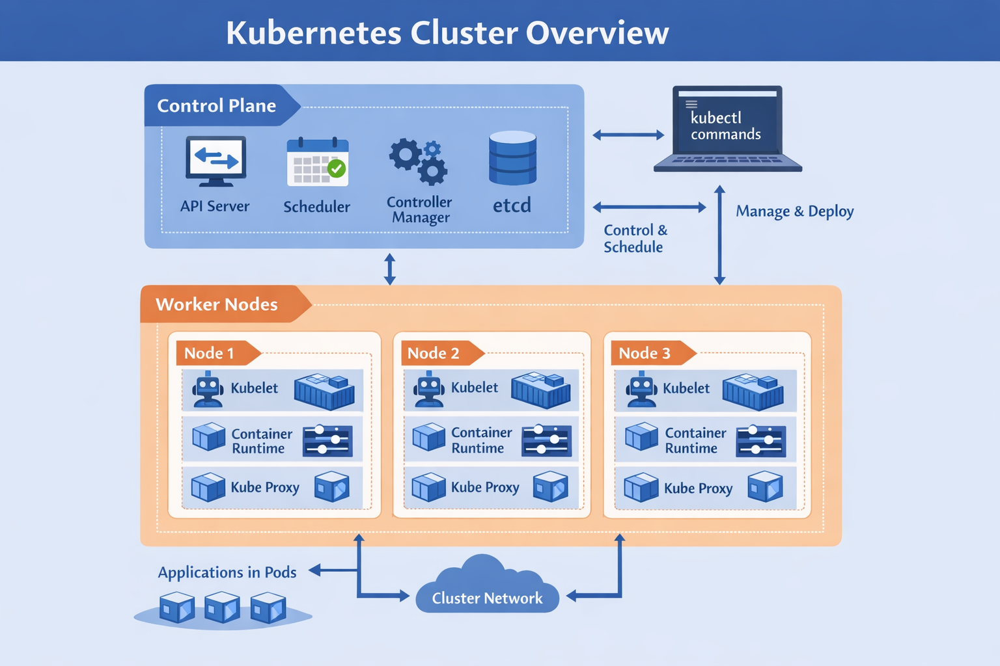
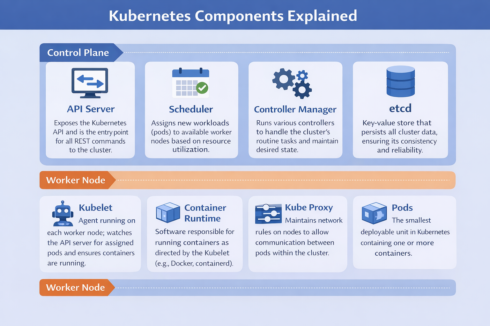

# Kubernetes (K8s) — Practical Understanding & Hands-on Labs 🚀

Welcome! In this repository, I will explain Kubernetes concepts in a simple and practical way, and provide all the hands-on labs to practice each topic. This is designed to help build a strong practical understanding and simulate real-world scenarios.

---

## 🔥 Why Kubernetes Exists (The Real Problem)

Modern applications are no longer simple programs running on a single server.  

Today’s production environments include:  

- **Microservices architectures** – each service runs independently  
- **Distributed systems** – running across multiple machines  
- **Dynamic and unpredictable traffic** – sudden spikes in usage  
- **High availability requirements** – downtime is unacceptable  

Managing this manually leads to serious challenges.  

---

### ❌ Key Problems in Real Environments

1. **Inefficient Scaling**  
   - Manual scaling is slow  
   - Over-provisioning wastes resources  
   - Under-provisioning causes downtime  

2. **Lack of Self-Healing**  
   - If a container crashes, it stays down unless manually restarted  
   - Leads to service disruption and poor reliability  

3. **Risky Deployments**  
   - Updates can introduce failures  
   - No safe rollout or automated rollback  

4. **Infrastructure Complexity**  
   - Managing containers across multiple nodes is hard  
   - No centralized control  
   - Troubleshooting is difficult  

---

## 💡 How Kubernetes Solves These Problems

Kubernetes provides automation and orchestration to handle these challenges:  

- **Automated Deployment & Scaling** – scale up/down automatically based on load  
- **Self-Healing** – restarts crashed Pods to maintain desired state  
- **Rolling Updates & Rollbacks** – update apps without downtime; rollback if needed  
- **Load Balancing & Service Discovery** – distributes traffic and auto-detects new Pods  
- **Declarative Desired State** – you define what you want, Kubernetes ensures reality matches it  

## 🏗️ Kubernetes Cluster Architecture

A Kubernetes cluster is divided into two main parts:

### 🔹 Control Plane (Cluster Management)
Responsible for making global decisions about the cluster (e.g., scheduling), detecting and responding to cluster events.

**Components:**
- **API Server** – The entry point to the cluster; validates and processes requests.
- **etcd** – Distributed key-value store that holds the entire cluster state.
- **Scheduler** – Assigns Pods to appropriate nodes based on resources and constraints.
- **Controller Manager** – Ensures the system matches the desired state. For example, if a Pod fails, it recreates it automatically.

### 🔹 Worker Nodes (Workload Execution)
Responsible for running application containers.

**Components:**
- **Kubelet** – Node agent that communicates with the Control Plane and ensures containers are running correctly.
- **Container Runtime** – Software responsible for running containers (e.g., Docker, containerd).
- **Kube-Proxy** – Handles networking rules to enable communication between Pods.

