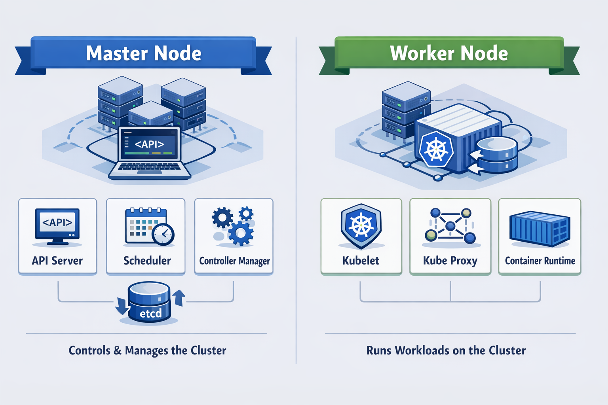

# Kubernetes (K8s) — Practical Understanding & Hands-on Labs 🚀

---

## 🔥 Why Kubernetes Exists (The Real Problem)

Modern systems are no longer simple applications running on a single server.

Today’s production environments include:

* Microservices architectures
* Distributed systems across multiple machines
* Dynamic and unpredictable traffic
* Strict requirements for high availability

Managing this manually leads to serious challenges.

---

### ❌ Key Problems in Real Environments

#### 1. Scaling is Inefficient

Applications cannot automatically handle traffic spikes.

* Manual scaling is slow
* Over-provisioning wastes resources
* Under-provisioning causes downtime

---

#### 2. Lack of Self-Healing

When a container crashes:

* It stays down unless manually restarted

This leads to:

* Service disruption
* Poor reliability

---

#### 3. Risky Deployments

Updating applications can introduce failures:

* No safe rollout strategies
* No automated rollback

---

#### 4. Infrastructure Complexity

Managing containers across multiple nodes:

* No centralized control
* Limited visibility
* Difficult troubleshooting

---

## 💡 Kubernetes Solution

Kubernetes solves these problems through automation and orchestration.

It provides:

* Automated deployment
* Self-healing systems
* Horizontal scaling
* Load balancing
* Zero-downtime updates

---

## 🧠 Core Concept: Declarative Desired State

Kubernetes operates using a declarative model.

You define the desired state of your system, for example:

* Number of replicas
* Container image
* Resource limits

Kubernetes continuously ensures that the actual state matches the desired state.

---

## 🏗️ Cluster Architecture Overview

A Kubernetes cluster is divided into:

### 🔹 Control Plane (Cluster Management)

Responsible for making global decisions.
### 🔹 Worker Nodes (Workload Execution)

Responsible for running application containers.

---

## ⚙️ Control Plane Components

### API Server

* Entry point to the cluster
* Validates and processes requests

---

### etcd

* Distributed key-value store
* Holds the entire cluster state

---

### Scheduler

* Assigns Pods to appropriate nodes
* Based on available resources and constraints

---

### Controller Manager

* Ensures system consistency
* Maintains the desired state

Example:
If a Pod fails → it recreates it automatically

---

## 🖥️ Worker Node Components

### Kubelet

* Node agent
* Communicates with Control Plane
* Ensures containers are running correctly

---

### Container Runtime

* Responsible for running containers
* Examples: containerd, Docker

---

### Kube Proxy

* Handles networking rules
* Enables communication between Pods

---

## 📦 Core Kubernetes Objects

### Pod

* Smallest deployable unit
* Contains one or more containers

---

### Deployment

* Manages Pods lifecycle
* Supports scaling and updates

---

### Service

* Provides stable network access
* Enables load balancing

---

## 🔄 How Kubernetes Works (Execution Flow)

1. Define desired state in YAML
2. Submit configuration using kubectl
3. API Server validates request
4. Scheduler selects target node
5. Kubelet starts containers
6. Controllers continuously monitor system
7. Services expose applications

---

## 🧪 Hands-on Labs

This repository includes structured labs covering:

* Pods
* Deployments
* Services
* ConfigMaps & Secrets
* Volumes (PV, PVC)
* RBAC
* Networking

Each lab contains:

* Problem statement
* YAML solution
* Command references

---

## 🎯 Objective

This repository is designed to:

* Build a strong practical understanding of Kubernetes
* Provide real hands-on experience
* Simulate real-world DevOps scenarios
* Prepare for Kubernetes certifications (CKA)

---

## 💼 Professional Focus

This project demonstrates:

* Understanding of Kubernetes architecture
* Ability to design and manage containerized workloads
* Hands-on experience with real configurations
* Readiness for production-level environments

---

