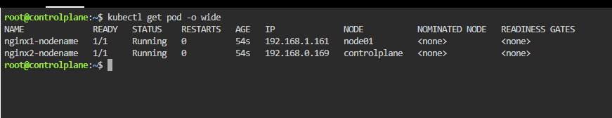

# Kubernetes NodeName Lab (KillerCoda Cluster)

This lab demonstrates **scheduling multiple Pods on specific nodes** using the `nodeName` field in a cluster with **controlplane** and **node01** nodes.

---

## Lab Objective

- Schedule multiple Pods on specific nodes (`controlplane` and `node01`).  
- Verify Pod placement using `kubectl get pods -o wide`.  
- Understand node details using `kubectl get nodes -o wide`.

---

## Prerequisites

- Kubernetes cluster on KillerCoda with nodes: `controlplane` and `node01`.  
- `kubectl` installed and configured.  
- Basic knowledge of Pods, containers, and Services.

---

## YAML Overview

The YAML file `nginx-nodename.yaml` contains **two Pods**:

1. **nginx1-nodename** → scheduled on **node01**  
2. **nginx2-nodename** → scheduled on **controlplane**

Optional: a Service (`nginx-service`) to access both Pods.

> Both Pods are defined in the **same YAML file** separated by `---`.

---

## Lab Steps

### 1. Apply the YAML

```bash
kubectl apply -f nginx-nodename.yaml
### 1. verfiy pod placement
kubectl get pod -o wide
# expect output

