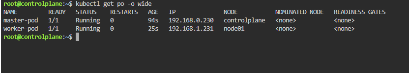

# =========================
# Lab: nodeSelector Example
# =========================

## Overview
We have two nodes: control-plane and node01.
We will deploy:
1. master-pod → runs on master node
2. worker-pod → runs on worker node

We use nodeSelector to schedule Pods on specific nodes.

---

## Step 1: Label the Nodes

# Label master node
kubectl label node control-plane role=master

# Label worker node
kubectl label node node01 role=worker

# Verify labels
kubectl get nodes --show-labels

# Expected output:
# NAME          STATUS   ROLES           LABELS
# control-plane Ready    control-plane   role=master
# node01        Ready    <none>          role=worker

---

## Step 2: Create Pod YAML

# Save this as pods.yaml
apiVersion: v1
kind: Pod
metadata:
  name: master-pod
spec:
  containers: 
    - name: nginx
      image: nginx
  nodeSelector:
    role: master
---
apiVersion: v1
kind: Pod
metadata:
  name: worker-pod
spec:
  containers:
    - name: nginx
      image: nginx
  nodeSelector:
    role: worker

---

## Step 3: Apply the Pods

kubectl apply -f pods.yaml

---

## Step 4: Verify Pod Placement

kubectl get pods -o wide

# Expected output:
# NAME        READY  STATUS   NODE
# master-pod  1/1    Running  control-plane
# worker-pod  1/1    Running  node01

---

## Step 5: Additional Notes

- nodeSelector ensures Pods run **only** on Nodes with matching labels.
- If no Node matches, the Pod will remain in `Pending`.
- Example: list Pods with a specific label:
kubectl get pods -l role=worker

- Labels can be used for grouping and selection.
- nodeSelector is simple but strict: no fallback Node.

---

## Author
Ahmed Rabie